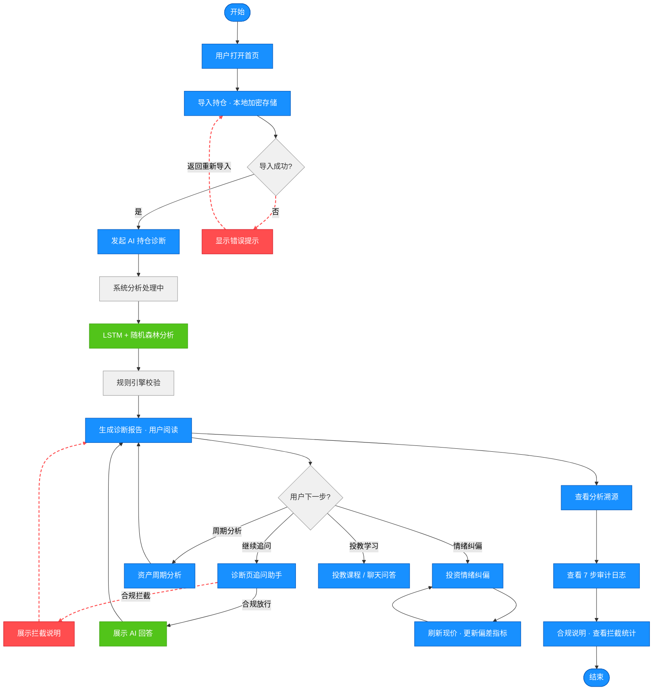
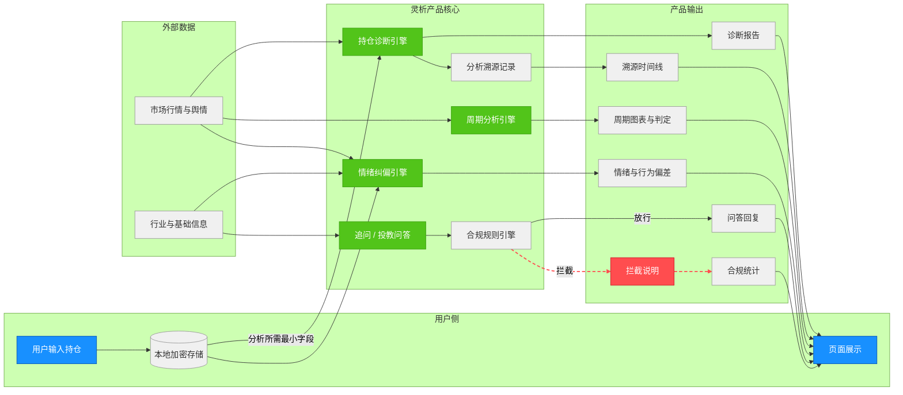

# 灵析 AI 智能投顾助手 — 产品需求文档（PRD）

---

## 1. 文档信息


| 项        | 内容                             |
| -------- | ------------------------------ |
| **产品名称** | 灵析 AI 智能投顾助手                   |
| **文档版本** | v2.1              |
| **更新日期** | 2026-06-23                     |
| **负责人**  | 杨文娜（产品负责人·0→1）                    |
| **文档状态** | 评审通过（个人项目模拟评审）                            |
| **适用读者** | 面试官 / 作品集审阅 |              |
| **关联文档** | 架构说明、功能清单、产品介绍脚本（见目录） |


### 修订记录


| 版本   | 日期         | 修订人 | 修订说明                       |
| ---- | ---------- | --- | -------------------------- |
| v1.0 | 2026-05-25 | 杨文娜 | 初稿：完成功能框架与技术方案              |
| v2.0 | 2026-06-15 | 杨文娜 | 重构：按企业级 PRD 规范调整结构，剥离技术实现，补充场景描述 |
| v2.1 | 2026-06-23 | 杨文娜 | 补充 AI 模型迭代数据：随机森林 V2.2（61.17%）、LSTM V2.0、架构与功能描述对齐 |


---

## 2. 背景与目标

### 2.1 市场背景

中国个人投资者规模持续扩大，散户参与股票、基金、ETF 的比例逐年上升。与此同时，市场信息高度碎片化：财经资讯、社群观点、短视频解读相互矛盾，投资者普遍面临**信息过载**。

在波动行情中，大量散户呈现典型非理性行为：**追涨杀跌、频繁换手、过度集中单一行业或个股**。监管层面亦明确要求 AI 理财辅助工具**不得荐股、不得承诺收益、必须可解释、必须留痕**。

灵析切入的是「**有持仓、缺方法、怕越界**」的广大个人投资者——他们需要的不是更多资讯，而是**可理解、可信任、可复盘**的持仓分析与决策辅助。

### 2.2 用户痛点


| 痛点          | 用户原声               | 影响             |
| ----------- | ------------------ | -------------- |
| **看不懂持仓**   | 「买了好几只，不知道整体风险大不大」 | 集中度失控、亏损扩大后才发现 |
| **不知道周期位置** | 「这只贵不贵、现在处于什么阶段？」  | 高位接盘或过早离场      |
| **管不住情绪**   | 「一跌就想卖，一涨就想追」      | 交易成本上升、长期收益受损  |
| **不信任 AI**  | 「结论从哪来的？能不能信？」     | 产品使用深度低、口碑难建立  |
| **隐私顾虑**    | 「不想把持仓上传到网上」       | 导入意愿低、留存差      |
| **边界模糊**    | 「能不能告诉我该不该买？」      | 合规风险、用户误用      |


### 2.3 产品目标


| 目标维度       | 描述                          | 衡量方向          |
| ---------- | --------------------------- | ------------- |
| **降低分析门槛** | 将复杂持仓结构转化为可读的风险摘要、周期参考与行为提示 | 诊断完成率、功能渗透率   |
| **辅助理性决策** | 提供信息参考与知识支持，**决策权始终归属用户**   | 用户反馈「有用率」、复访率 |
| **建立信任闭环** | 每次分析可溯源、合规可统计、隐私可控制         | 溯源查看率、合规拦截留痕  |
| **控制合规风险** | 明确 AI 能力边界，拦截越界咨询           | 拦截次数、零越界输出    |


**产品定位（一句话）：**  
灵析是一款**人机协同的 AI 理财辅助工具**——AI 负责数据处理与信息提炼，用户做最终投资决策。

**产品边界：**


| AI 可以做        | AI 不能做    |
| ------------- | --------- |
| 分析持仓结构与风险分布   | 推荐具体买卖时机  |
| 提供估值周期阶段参考    | 预测股价或承诺收益 |
| 监测市场情绪与行为偏差   | 提供内幕消息或荐股 |
| 解答理财知识、解释诊断结论 | 替代用户做投资决策 |


---

## 3. 用户与场景

### 3.1 目标用户画像

#### 画像 A：理财新手「小林」


| 维度   | 描述                    |
| ---- | --------------------- |
| 年龄   | 25～35 岁               |
| 资产规模 | 可投资资产 5～30 万元         |
| 投资经验 | 1～3 年，持有 3～8 只基金/股票   |
| 特征   | 信息获取渠道多但缺乏框架，容易被热点带动  |
| 核心诉求 | 快速看懂「我的持仓安不安全」、学习基础概念 |


#### 画像 B：进阶散户「老王」


| 维度   | 描述                 |
| ---- | ------------------ |
| 年龄   | 35～50 岁            |
| 资产规模 | 可投资资产 30～200 万元    |
| 投资经验 | 5 年以上，关注行业轮动与估值    |
| 特征   | 有一定分析习惯，但情绪管理仍是短板  |
| 核心诉求 | 周期参考、行为纠偏、诊断后可追问细节 |


#### 画像 C：合规与业务评审方


| 维度   | 描述                         |
| ---- | -------------------------- |
| 角色   | 金融机构产品、合规、风控人员             |
| 核心诉求 | 验证 AI 边界清晰、分析过程可追溯、违规咨询可拦截 |


### 3.2 核心使用场景

#### 场景 1：首次使用 — 导入并诊断

```
打开产品 → 导入持仓（本地保存）→ 发起 AI 持仓诊断 → 阅读风险摘要与机会提示
```

**价值：** 5 分钟内获得整仓视角，替代手工 Excel 汇总。
<div style="display: flex; gap: 20px; justify-content: center;">
  
  
</div>
<p style="text-align: center; color: #666;">图：主导航页（左） → 导入持仓（右）</p>
<div style="display: flex; gap: 20px; justify-content: center;">
  
  
</div>
<p style="text-align: center; color: #666;">图：诊断结果（左） → 诊断结果（右）上下连接</p>

#### 场景 2：深度理解 — 溯源与追问

```
完成诊断 → 查看分析溯源（了解分析依据）→ 在诊断页底部追问「我的持仓集中吗？」
```

**价值：** 消除「黑盒感」，支持基于自身持仓的个性化答疑。
<div style="display: flex; gap: 20px; justify-content: center;">
  
  
</div>
<p style="text-align: center; color: #666;">图：查看分析溯源页（左） → 查看分析溯源页（右）上下连接</p>
<div style="display: flex; gap: 20px; justify-content: center;">
  
  
</div>
<p style="text-align: center; color: #666;">图：查看分析溯源页（左） → 持仓诊断页（右）</p>

#### 场景 3：周期判断 — 单资产分析

```
选择持仓中的某只股票 → 查看 PE/PB 历史分位与周期判定 → 参考趋势延伸线
```

**价值：** 辅助判断「贵/便宜/合理」，但不给出买卖指令。
<div style="display: flex; gap: 20px; justify-content: center;">
  
  
</div>
<p style="text-align: center; color: #666;">图：资产分析（左） → 资产分析（右）上下连接</p>

#### 场景 4：情绪管理 — 行为纠偏

```
进入情绪纠偏页 → 查看市场情绪指数 → 对照自身持仓的行为偏差（集中度、亏损数量等）
→ 阅读行为矫正估算
```

**价值：** 将抽象的行为金融概念与**用户真实持仓**关联，提升自我觉察。
<div style="display: flex; gap: 20px; justify-content: center;">
  
  
</div>
<p style="text-align: center; color: #666;">图：情绪纠偏（左） → 情绪纠偏（右）上下连接</p>

#### 场景 5：持续学习 — 投教问答

```
浏览投教课程 → 在右侧聊天区提问理财概念 → 获得合规范围内的知识解答
```

**价值：** 学以致用，降低学习门槛。
<div style="display: flex; gap: 20px; justify-content: center;">
  
  
</div>
<p style="text-align: center; color: #666;"> 图：场景投教（左） → 场景投教（右）上下连接</p>
---

## 4. 功能范围

### 4.1 MVP 功能清单（优先级）


| 优先级     | 功能模块      | 说明                      | 当前状态 |
| ------- | --------- | ----------------------- | ---- |
| **P0**  | 导入持仓      | 本地录入/导入，隐私承诺，数据本地加密存储   | 已上线  |
| **P0**  | AI 持仓智能诊断 | 整仓风险与机会分析，生成可读报告        | 已上线  |
| **P0**  | 分析依据溯源    | 每次诊断对应完整分析链路，支持逐步查看     | 已上线  |
| **P0**  | 合规规则与拦截   | 禁止越界咨询，拦截留痕，合规面板统计      | 已上线  |
| **P1**  | 资产周期分析    | 单资产 PE/PB 分位、周期判定、趋势参考  | 已上线  |
| **P1**  | 投资情绪纠偏    | 市场情绪 + 基于真实持仓的行为偏差与矫正估算 | 已上线  |
| **P1**  | 诊断追问助手    | 诊断页底部，基于持仓上下文的智能问答      | 已上线  |
| **P1**  | 投教聊天问答    | 投教页右侧，理财知识即时问答          | 已上线  |
| **P2**  | 场景化投教课程   | 结构化课程库与详情页              | 已上线  |
| **P2**  | 商业价值展示    | 用户价值量化说明（首页/专页）         | 已上线  |
| **P2**  | 模型版本管理    | 分析模型迭代与回滚能力（运营侧）        | 已上线  |
| **规划中** | 用户账号体系    | 跨设备同步（需平衡隐私策略）          | v2.0 |
| **规划中** | 实盘回测      | 历史策略表现验证                | v2.0 |
| **规划中** | 智能调仓建议    | 仅资产配置方向参考，非个股买卖         | v2.0 |


### 4.2 非功能需求

#### 性能


| 指标         | 要求                           |
| ---------- | ---------------------------- |
| 持仓诊断（常规路径） | 用户要求等待 ≤ 30 秒；本地已有价格时优先快速出结果 |
| 页面首屏       | 主要功能页 3 秒内可交互                |
| 追问回复       | 合规放行后，用户感知等待 ≤ 15 秒          |
| 行情刷新       | 用户手动触发后，现价更新可见反馈 ≤ 10 秒      |


#### 安全


| 指标    | 要求                         |
| ----- | -------------------------- |
| 持仓数据  | 默认仅存于用户本地，加密存储，不上传云端       |
| 传输最小化 | 分析时仅传输分析所需的最小字段（代码、成本、数量等） |
| 用户控制  | 提供一键清除本地数据能力               |
| 密钥与凭证 | 第三方数据与 AI 服务凭证仅服务端持有，用户不可见 |


#### 合规


| 指标   | 要求                  |
| ---- | ------------------- |
| 能力边界 | 全产品常驻风险提示与免责声明      |
| 越界拦截 | 买卖建议、荐股、承诺收益类咨询必须拦截 |
| 留痕   | 拦截与分析过程可统计、可审计      |
| 输出规范 | AI 生成内容不得包含确定性收益承诺  |


#### 可用性


| 指标    | 要求                         |
| ----- | -------------------------- |
| 数据源异常 | 优先实时行情；异常时基于历史数据缓存保障服务连续可用 |
| 空状态   | 无持仓时引导导入；无诊断记录时引导发起诊断      |
| 容错    | 单次分析失败时给出明确原因与重试引导，不展示空白页  |


#### 可解释性


| 指标    | 要求                       |
| ----- | ------------------------ |
| 溯源完整性 | 每次诊断应形成完整、有序的分析步骤记录      |
| 来源标注  | 关键结论需标注数据来源（行情、持仓、模型参考等） |


---

## 5. 业务流程图

### 5.1 用户操作流程图




### 5.2 数据流图（产品视角）


> 图例：蓝色节点为用户操作，灰色为系统处理，绿色为 AI 模型，红色为异常流程。
## 5.3 系统架构图（四层架构）

灵析采用四层架构设计：交互层 → 规则风控层 → 模型层 → 数据层。

<div style="display: flex; gap: 20px; justify-content: center;">
  
</div>


> 图：灵析四层架构总览，蓝色为交互层、橙色为规则风控层、绿色为模型层、紫色为数据层。

**模型层（当前生产版本，2026-06 更新）**

| 模型 | 版本 | 输入特征 | 输出 | 核心指标 |
| --- | --- | --- | --- | --- |
| **LSTM 周期预测** | v2.0 | 7 维：收盘价、涨跌幅、成交量、PE/PB 历史分位、换手率、振幅 | 未来 5 个交易日趋势参考 | RMSE **3.39**，MAE 2.52 |
| **随机森林风险评级** | **v2.2** | **14 维**：波动率、换手率、PE/PB 分位、成交量变化率、振幅、RSI、均线乖离、布林带宽度、量比 + **3 项交互特征** | 低 / 中 / 高风险（三分类） | 测试准确率 **61.17%**，F1 **61.19%** |
| **DeepSeek LLM** | — | 用户问题 + 合规 Prompt + 诊断/投教上下文 | 追问回复、投教解答 | 合规前置拦截 |

> 训练数据规模（RF v2.2）：沪深 300 成分股 **300 只**，**3 年**日线，有效样本 **17,100** 条；数据划分 70% / 15% / 15%（训练 / 验证 / 测试）。

---

## 6. 功能详情

### 6.1 导入持仓

**用户故事**  
作为个人投资者，我想要在本地录入或导入我的持仓，以便在不暴露隐私的前提下使用后续分析功能。

**交互简述**

1. 用户进入导入页，手动添加或批量导入资产（代码、名称、类型、数量、成本）。
2. 首次导入需勾选《数据安全承诺》。
3. 保存成功后，系统自动拉取最新行情更新现价。
4. 用户可随时返回修改，或一键清除全部本地数据。
<div style="display: flex; gap: 20px; justify-content: center;">
  
</div>
<br/>
<p style="text-align: center; color: #666;">1. 用户进入导入页，手动添加或批量导入资产（代码、名称、类型、数量、成本）</p>
<div style="display: flex; gap: 20px; justify-content: center;">
  
</div>
<br/>
<p style="text-align: center; color: #666;">2. 首次导入需勾选《数据安全承诺》</p>
<div style="display: flex; gap: 20px; justify-content: center;">
  
</div>
<br/>
<p style="text-align: center; color: #666;">3. 保存成功后，系统自动拉取最新行情更新现价</p>
<div style="display: flex; gap: 20px; justify-content: center;">
  
</div>
<br/>
<p style="text-align: center; color: #666;">4. 用户可随时返回修改，或一键清除全部本地数据</p>

**业务规则**

- 持仓数据默认不上传云端，仅存于用户设备。
- 成本价由用户填写；现价为系统基于公开市场数据实时更新。
- 未导入持仓时，诊断、情绪纠偏等依赖持仓的功能需引导先导入。

**异常处理**

- 行情暂时不可用时，提示用户稍后刷新，并基于最近一次可用价格展示。
- 导入格式错误时，逐条标红并说明修正方式。
- 用户拒绝安全承诺时，不允许保存持仓。

---

### 6.2 AI 持仓智能诊断

**用户故事**  
作为持仓用户，我想要一键获得整仓风险与机会分析，以便快速了解「我的组合健康吗」。

**交互简述**

1. 用户从诊断页发起分析。
2. 输出诊断报告：风险资产、机会资产、整体趋势参考、置信度说明。
3. 用户可手动「刷新现价」后重新诊断。
4. 每次诊断生成唯一分析编号，供溯源使用。
<div style="display: flex; gap: 20px; justify-content: center;">
  
</div>
<br/>
<p style="text-align: center; color: #666;">1. 用户从诊断页发起分析</p>
<div style="display: flex; gap: 20px; justify-content: center;">
  
</div>
<div style="display: flex; gap: 20px; justify-content: center;">
  
</div>
<div style="display: flex; gap: 20px; justify-content: center;">
  
</div>
<br/>
<p style="text-align: center; color: #666;">2. 输出诊断报告：风险资产、机会资产、整体趋势参考、置信度说明</p>
<div style="display: flex; gap: 20px; justify-content: center;">
  
</div>
<br/>
<p style="text-align: center; color: #666;">3. 用户可手动「刷新现价」后重新诊断。</p>
**业务规则**

- 诊断结论为**参考信息**，不构成投资建议。
- 报告需区分「高风险」「机会」「中性」等可读标签。
- 单资产风险评级由**随机森林 v2.2**（14 维特征 + 规则引擎兜底）输出；模型未加载时自动降级规则引擎。
- 每次诊断必须形成完整分析链路记录，供溯源查询。
- 分析过程需经过合规规则校验后方可输出。

**异常处理**

- 单只资产数据缺失时，跳过该资产并在报告中标注「数据不足」。
- 分析超时：提示用户重试，并保留上次成功结果（如有）。
- 全部资产不可分析时，返回空报告并引导检查持仓或网络。

---

### 6.3 分析依据溯源

**用户故事**  
作为谨慎型投资者，我想要查看某次诊断的分析依据与步骤，以便判断结论是否可信。

**交互简述**

1. 诊断完成后，用户点击「查看溯源」进入溯源页。
2. 页面展示按时间顺序排列的分析步骤（请求接收 → 数据获取 → 清洗 → 模型参考 → 风险评估 → 规则校验 → 结果生成）。
3. 提供可视化血缘图：数据 → 处理 → 模型 → 输出。
4. 展示完整性标识：步骤是否齐全。
5. 展示用户使用反馈统计
<div style="display: flex; gap: 20px; justify-content: center;">
  
</div>
<br/>
<p style="text-align: center; color: #666;">1. 诊断完成后，用户点击「查看溯源」进入溯源页</p>
<div style="display: flex; gap: 20px; justify-content: center;">
  
</div>
<br/>
<p style="text-align: center; color: #666;">2. 页面展示按时间顺序排列的分析步骤（请求接收 → 数据获取 → 清洗 → 模型参考 → 风险评估 → 规则校验 → 结果生成）</p>
<div style="display: flex; gap: 20px; justify-content: center;">
  
</div>
<br/>
<p style="text-align: center; color: #666;">3. 提供可视化血缘图：数据 → 处理 → 模型 → 输出</p>
<div style="display: flex; gap: 20px; justify-content: center;">
  
</div>
<br/>
<p style="text-align: center; color: #666;">4. 展示完整性标识：步骤是否齐全</p>
<div style="display: flex; gap: 20px; justify-content: center;">
  
</div>
<div style="display: flex; gap: 20px; justify-content: center;">
  
</div>
<br/>
<p style="text-align: center; color: #666;">5. 展示用户使用反馈统计</p>

**业务规则**

- 每次诊断对应唯一分析编号，一一映射。
- 溯源内容为只读，用户不可篡改。
- 步骤名称与顺序在全产品内保持一致。

**异常处理**

- 步骤不完整时，明确标注缺失环节，不伪造完整记录。
- 分析编号无效时，引导用户返回最近一次有效诊断。

---

### 6.4 诊断追问助手

**用户故事**  
作为刚看完诊断报告的用户，我想要针对报告内容继续提问，以便弄懂「我的茅台亏了多少」「整体风险集中吗」等问题。

**交互简述**

1. 诊断结果页底部提供追问输入框。
2. 用户输入自然语言问题，系统基于本次诊断上下文回答。
3. 若问题涉及持仓内资产，回答可包含成本、现价、盈亏等持仓信息。
4. 若问题涉及持仓外资产，仅提供通用介绍，并附加免责声明。
5. 越界问题（如「能买吗」）直接拦截，展示合规提示。
<div style="display: flex; gap: 20px; justify-content: center;">
  
</div>
<br/>
<p style="text-align: center; color: #666;">1. 诊断结果页底部提供追问输入框</p>
<div style="display: flex; gap: 20px; justify-content: center;">
  
</div>
<br/>
<p style="text-align: center; color: #666;">2. 用户输入自然语言问题，系统基于本次诊断上下文回答</p>
<div style="display: flex; gap: 20px; justify-content: center;">
  
</div>
<br/>
<p style="text-align: center; color: #666;">3. 若问题涉及持仓内资产，回答可包含成本、现价、盈亏等持仓信息。</p>
<div style="display: flex; gap: 20px; justify-content: center;">
  
</div>
<br/>
<p style="text-align: center; color: #666;">4. 若问题涉及持仓外资产，仅提供通用介绍，并附加免责声明。</p>
<div style="display: flex; gap: 20px; justify-content: center;">
  
</div>
<br/>
<p style="text-align: center; color: #666;">5. 越界问题（如「能买吗」）直接拦截，展示合规提示。</p>
**业务规则**

- 所有问题必须先经过合规规则校验，命中越界词汇则拒绝回答。
- 不得对任何资产生成买卖建议或收益承诺。
- 回答需与当前诊断上下文一致，不得编造未出现在诊断中的持仓数据。
- 拦截行为需计入合规统计。

**异常处理**

- 合规拦截：展示标准拦截文案，不调用 AI 生成。
- AI 服务暂不可用时：提示「问答服务繁忙，请稍后重试」。
- 问题与持仓无关且无法识别时：引导用户换一种问法或查看投教内容。

---

### 6.5 资产周期分析

**用户故事**  
作为关注估值的投资者，我想要了解某只股票当前处于高估、合理还是低估区间，以便辅助周期判断。

**交互简述**

1. 用户从持仓列表或搜索中选择资产。
2. 页面展示 PE/PB 历史分位、当前区间判定（低估 / 合理 / 高估）。
3. 图表展示历史走势及短期趋势参考线（未来若干交易日延伸）。
4. 文字说明当前周期阶段与参考区间，不含买卖指令。
<div style="display: flex; gap: 20px; justify-content: center;">
  
</div>
<br/>
<p style="text-align: center; color: #666;">1. 用户从持仓列表或搜索中选择资产</p>
<div style="display: flex; gap: 20px; justify-content: center;">
  
</div>
<br/>
<p style="text-align: center; color: #666;">2. 页面展示 PE/PB 历史分位、当前区间判定（低估 / 合理 / 高估）</p>
<div style="display: flex; gap: 20px; justify-content: center;">
  
</div>
<br/>
<p style="text-align: center; color: #666;">3. 图表展示历史走势及短期趋势参考线（未来若干交易日延伸）</p>

**业务规则**

- 周期判定基于历史估值分位，标注「仅供参考」。
- 趋势延伸线由 **LSTM v2.0** 生成：30 日 × 7 特征滑窗 → 预测未来 5 日，为模型参考输出，非价格预测承诺。
- 数据不足（上市时间短、缺估值）时不给出区间判定，仅展示已有数据。

**异常处理**

- 历史数据不足 1 年时，提示「样本偏少，结论置信度较低」。
- 行情更新失败时，图表标注数据时间戳，并支持手动刷新。

---

### 6.6 投资情绪纠偏

**用户故事**  
作为容易受市场情绪影响的投资者，我想要看到当前市场温度以及**我自己**的行为偏差，以便克制冲动交易。

**交互简述**

1. 页面顶部展示市场情绪指数（恐慌—中性—贪婪）及市场状态描述。
2. 中部展示四项行为偏差卡片：
  - **确认偏误**：最高行业占持仓市值比例
  - **损失厌恶**：当前亏损资产数量
  - **羊群效应**：行业集中度水平
  - **过度自信**：持仓分散程度
3. 底部展示**行为矫正估算**（基于真实持仓的动态估算）：潜在情绪化损失、可减少的冲动交易次数、改善空间参考。
4. 用户可「刷新现价」更新偏差计算。
<div style="display: flex; gap: 20px; justify-content: center;">
  
</div>
<br/>
<p style="text-align: center; color: #666;">1. 页面顶部展示市场情绪指数（恐慌—中性—贪婪）及2. 市场状态描述与展示四项行为偏差卡片。</p>
<div style="display: flex; gap: 20px; justify-content: center;">
  
</div>
<br/>
<p style="text-align: center; color: #666;">3. 底部展示**行为矫正估算**（基于真实持仓的动态估算）：潜在情绪化损失、可减少的冲动交易次数、改善空间参考</p>
<div style="display: flex; gap: 20px; justify-content: center;">
  
</div>
<br/>
<p style="text-align: center; color: #666;">4. 用户可「刷新现价」更新偏差计算。</p>
**业务规则**

- 行为偏差必须基于用户真实持仓计算，与诊断页数据同源。
- 情绪指数基于公开市场舆情与交易数据实时计算。
- 行为矫正估算为参考模型输出，不构成收益承诺。
- 页面需标注各指标的数据来源说明。

**异常处理**

- 无持仓时：展示市场情绪，行为偏差区引导先导入持仓。
- 部分资产缺少成本或现价：该资产不参与盈亏统计，并提示补全。
- 行业信息暂不可用时，该资产归入「综合」类，不影响其余指标计算。

---

### 6.7 投教聊天问答

**用户故事**  
作为理财学习者，我想要在浏览课程时随时提问概念问题，以便即时弄懂不懂的名词。

**交互简述**

1. 投教页左侧为课程列表，右侧为聊天问答区。
2. 用户输入问题，系统返回 200～400 字的通俗解答。
3. 保留最近若干轮对话，支持连续追问，支持拦截违禁词，每条回答附带免责声明。
4. 支持商业变现
<div style="display: flex; gap: 20px; justify-content: center;">
  
</div>
<br/>
<p style="text-align: center; color: #666;">1. 投教页左侧为课程列表，右侧为聊天问答区</p>
<div style="display: flex; gap: 20px; justify-content: center;">
  
</div>
<br/>
<p style="text-align: center; color: #666;">2. 用户输入问题，系统返回 200～400 字的通俗解答。</p>
<div style="display: flex; gap: 20px; justify-content: center;">
  
</div>
<br/>
<p style="text-align: center; color: #666;">3. 保留最近若干轮对话，支持连续追问，每条回答附带免责声明。</p>
<div style="display: flex; gap: 20px; justify-content: center;">
  
</div>
<div style="display: flex; gap: 20px; justify-content: center;">
  
</div>
<br/>
<p style="text-align: center; color: #666;">4. 支持商业变现</p>
**业务规则**

- 仅回答理财知识类问题，不提供个股买卖建议。
- 回答长度与风格需适合散户阅读，避免过度专业术语堆砌。
- 与诊断追问助手区分：投教问答不带用户持仓上下文。

**异常处理**

- 问题涉及买卖建议时，按合规规则拦截或改写为知识科普。
- 服务繁忙时排队提示，不返回空白。

---

### 6.8 场景化投教课程

**用户故事**  
作为想系统学习的用户，我想要按主题浏览理财课程，以便建立基础知识框架。

**交互简述**

1. 课程列表按主题分类（基础、行为金融、风险管理等）。
2. 点击进入课程详情，阅读结构化内容。
3. 课程页可跳转至右侧聊天区继续提问。
<div style="display: flex; gap: 20px; justify-content: center;">
  
</div>
<br/>
<p style="text-align: center; color: #666;">1. 课程列表按主题分类（基础、行为金融、风险管理等）。</p>
<div style="display: flex; gap: 20px; justify-content: center;">
  
</div>
<br/>
<p style="text-align: center; color: #666;">2. 点击进入课程详情，阅读结构化内容。</p>
<div style="display: flex; gap: 20px; justify-content: center;">
  
</div>
<br/>
<p style="text-align: center; color: #666;">3. 课程页可跳转至右侧聊天区继续提问。</p>
**业务规则**

- 课程内容需与产品合规边界一致，不含荐股内容。
- 行为金融类课程与情绪纠偏页形成呼应，强化认知。

**异常处理**

- 课程内容加载失败时，展示重试按钮。

---

### 6.9 合规说明与统计

**用户故事**  
作为关注合规的用户或评审方，我想要了解产品的 AI 能力边界与拦截情况，以便建立信任。

**交互简述**

1. 合规专页展示三层风控说明：规则拦截、分析溯源、隐私保护。
2. 展示合规价值量化指标：累计拦截次数、规则通过率等（**基于系统运行日志的实时统计**）。
3. 全站常驻风险提示 Banner。
<div style="display: flex; gap: 20px; justify-content: center;">
  
</div>
<br/>
<p style="text-align: center; color: #666;">1. 合规专页展示三层风控说明：规则拦截、分析溯源、隐私保护。</p>

<div style="display: flex; gap: 20px; justify-content: center;">
  
</div>
<br/>
<p style="text-align: center; color: #666;">2. 展示合规价值量化指标：累计拦截次数、规则通过率等（**基于系统运行日志的实时统计**）。</p>
<div style="display: flex; gap: 20px; justify-content: center;">
  
</div>
<br/>
<p style="text-align: center; color: #666;">3. 全站常驻风险提示 Banner。</p>

**业务规则**

- 统计指标来源于系统运行日志，动态刷新。
- 系统尚无运行日志记录时，展示产品设计目标值并标注数据来源说明。
- 禁止词库可配置扩展，变更需留痕。

**异常处理**

- 统计服务暂不可用时，展示最近一次成功拉取的统计快照及更新时间。

---

### 6.10 模型版本管理（运营能力）

**用户故事**  
作为产品运营人员，我想要在分析模型升级异常时快速回退至稳定版本，以便保障用户体验连续稳定。

**交互简述**

1. 运营后台查看当前生效模型版本与历史版本列表。
2. 选择目标版本执行回退。
3. 回退后用户侧分析能力无感知切换，无需重启产品。

 > 注：该功能为后台运营能力，无用户侧界面。通过 HTTP 管理接口 `/api/admin/model/rollback` 执行。

**业务规则**

- 每次模型训练完成自动归档版本，保留评估指标（准确率、F1、RMSE 等）。
- 当前生产版本：**LSTM v2.0**、**随机森林 v2.2**（详见 §6.11）。
- 支持按比例灰度发布新版本，默认小流量验证（`NEW_MODEL_RATIO=5`）。
- 回退操作需记录操作人与时间。

**异常处理**

- 目标版本文件缺失时，拒绝回退并告警。
- 灰度期间若指标异常，运营可一键回退。

---

### 6.11 AI 分析模型（当前实现）

灵析诊断链路采用 **LSTM（时序）+ 随机森林（分类）+ 规则引擎（兜底）** 双模型协同。以下为截至 2026-06-23 的模型迭代记录与评估数据。

#### 6.11.1 随机森林风险评级 — 迭代路径

| 版本 | 主要变更 | 测试准确率 | 相对 V1 提升 |
| --- | --- | --- | --- |
| **V1** | 基线（4 维：波动率、换手率、PE 分位、成交量变化率） | **46.16%** | — |
| **V2** | 新增 PE/PB 分位、振幅 | **54.82%** | +8.66 pp |
| **V2.1** | 新增 RSI、MA 乖离、布林带宽度、成交量 MA5 比值 | **56.91%** | +10.75 pp |
| **V2.2** | 交互特征（PE 分位×波动率、PB 分位×换手率、振幅×成交量变化率）+ RandomizedSearchCV 超参调优 | **61.17%** | **+15.01 pp** |

**V2.2 详细指标（独立测试集 15%）**

| 指标 | 数值 |
| --- | --- |
| 准确率 | **61.17%** |
| 召回率（macro） | 61.23% |
| F1（macro） | 61.19% |
| 验证集准确率 | 61.01% |

**V2.2 特征构成（14 维）**

- **基础特征（11 维）**：波动率、换手率、PE 分位、PB 分位、成交量变化率、振幅、RSI(14)、MA5/MA20 乖离、布林带宽度、成交量/5 日均量比
- **交互特征（3 维）**：PE 分位×波动率、PB 分位×换手率、振幅×成交量变化率
- **Top 5 特征重要性**：PB 分位、PE 分位、**PE 分位×波动率**（交互项 #3）、波动率、布林带宽度

**最优超参数**：`n_estimators=200`，`max_depth=20`，`min_samples_split=2`，`min_samples_leaf=1`

#### 6.11.2 LSTM 周期预测 — 当前版本

| 版本 | 主要变更 | 核心指标 |
| --- | --- | --- |
| v1.0 | 单特征（收盘价） | RMSE 较高（基线） |
| v1.x | 五特征（+涨跌幅、成交量、PE/PB 分位） | RMSE 14.56（-31%） |
| **v2.0（生产）** | 七特征（+换手率、振幅）；AKShare 估值优先 | **RMSE 3.39**，MAE 2.52 |

> LSTM 与 RF 解耦迭代：RF 冲刺 v2.2 期间 LSTM 保持 v2.0 稳定版本，未同步重训。

#### 6.11.3 数据与评估说明

| 项 | 说明 |
| --- | --- |
| 股票池 | 沪深 300 成分股，300 只 |
| 时间跨度 | 3 年日线 |
| 有效样本 | 17,100 条 |
| 标签定义 | 未来 20 日收益率三分位 → 低/中/高风险 |
| 评估划分 | RF v2.2：70% 训练 / 15% 验证 / 15% 测试；历史版本多为 80% / 20% |

**产品侧表述原则**：上述指标为离线 hold-out 评估结果，用于衡量模型迭代效果；线上输出仍为「参考信息」，不构成投资建议或收益承诺。

---
## 7. 数据与反馈

### 7.1 AI 反馈

用户在诊断结果页点击「有帮助」或「需改进」，反馈存入数据库，溯源页可查看历史记录。
<div style="display: flex; gap: 20px; justify-content: center;">
  
</div>
<br/>
<p style="text-align: center; color: #666;">1. 用户在诊断结果页点击「有帮助」或「需改进」</p>
<div style="display: flex; gap: 20px; justify-content: center;">
  
</div>
<br/>
<p style="text-align: center; color: #666;">2. 反馈存入数据库，溯源页可查看历史记录</p>

### 7.2 合规拦截

规则引擎拦截违规提问并记录日志，合规页展示累计拦截次数。

<div style="display: flex; gap: 20px; justify-content: center;">
  
</div>
<br/>
<p style="text-align: center; color: #666;">1. 规则引擎拦截违规提问</p>
<div style="display: flex; gap: 20px; justify-content: center;">
  
</div>
<br/>
<p style="text-align: center; color: #666;">2. 追问助手进行拦截</p>
<div style="display: flex; gap: 20px; justify-content: center;">
  
</div>
<br/>
<p style="text-align: center; color: #666;">3. 合规页展示累计拦截次数</p>


## 8. 数据埋点（产品侧）

### 8.1 核心指标


| 指标类别   | 指标名称   | 定义                | 目标方向 |
| ------ | ------ | ----------------- | ---- |
| **质量** | AI 有用率 | 正向反馈 /（正向 + 负向反馈） | ↑    |
| **合规** | 拦截率    | 被合规规则拦截的咨询占比      | 监控   |


### 8.2 埋点事件

### 当前已实现

- **AI 反馈**：用户在诊断结果页点击「有帮助」或「需改进」，反馈记录存入数据库，溯源页展示历史反馈列表。
- **合规拦截**：追问助手触发规则引擎拦截时，记录拦截日志，合规页累计展示拦截次数。

### 后续规划

- 接入友盟/神策等埋点工具，实现页面访问、功能点击、用户行为路径分析。
- 建立 DAU、留存率、诊断完成率等核心运营指标看板。
> 注：当前版本聚焦核心诊断与合规闭环，深度运营指标将在 v2.1 版本完善。

---

## 9. 商业价值测算

### 9.1 用户价值


| 价值项      | 说明                 | 量化参考（单用户 / 年）               |
| -------- | ------------------ | --------------------------- |
| **节省时间** | 替代手工汇总持仓、查阅多源资讯    | 节省分析时间约 40～80 小时            |
| **避免损失** | 通过集中度预警、行为纠偏减少冲动交易 | 行为矫正估算：潜在减少情绪化损失（因人因账户规模而异） |
| **提升认知** | 投教 + 追问降低学习成本      | 相当于节省 2～5 次付费咨询费用           |
| **隐私安心** | 本地存储，无需上传完整持仓      | 降低隐私泄露心理成本（定性）              |


**用户价值总结：** 灵析将「专业分析能力」下沉至散户可触达、可理解、可信任的产品形态，**降低决策信息门槛，而非替代决策本身**。

### 9.2 平台价值


| 价值项       | 说明                   | 商业化路径             |
| --------- | -------------------- | ----------------- |
| **增值服务**  | 高阶周期分析、深度行为报告、专属投教   | 会员订阅（月 / 年）       |
| **B 端合作** | 券商、基金销售机构嵌入白标分析能力    | SaaS 授权费 + 按调用量计费 |
| **数据洞察**  | 聚合脱敏后的行为与情绪趋势（合规前提下） | 机构研究报告合作          |
| **品牌信任**  | 合规可溯源的 AI 理财助手差异化    | 降低获客成本、提升转化       |


**平台价值测算参考（假设性）：**


| 假设        | 数值                   |
| --------- | -------------------- |
| 月活用户      | 10 万                 |
| 付费转化率     | 3%                   |
| 月会员费      | 29 元                 |
| **月订阅收入** | **≈ 8.7 万元**         |
| 年订阅收入     | **≈ 104 万元**（未计 B 端） |


>  注：以下为基于典型 SaaS 产品模型的假设性测算，非实际运营数据，用于展示商业潜力。

### 9.3 合规价值


| 价值项        | 说明                  | 量化方式                         |
| ---------- | ------------------- | ---------------------------- |
| **降低监管风险** | 越界咨询拦截、分析留痕         | **基于系统运行日志的实时统计**：拦截次数、规则通过率 |
| **降低声誉风险** | 可溯源、可解释，减少「AI 胡说」投诉 | 负向反馈率、人工复核量                  |
| **降低法律风险** | 明确免责声明与能力边界         | 合规审计通过率                      |
| **运营效率**   | 自动化合规校验，减少人工审核      | 人工介入率下降                      |


**合规价值总结：** 在 AI 理财赛道，**合规不是成本中心，而是产品信任与商业可持续的前提**。灵析将合规能力产品化（拦截 → 留痕 → 统计 → 展示），形成可量化的风控资产。

---

## 10. 版本规划

### 10.1 版本路线图

| 产品版本 | 时间 | 核心目标 | 关键功能 |
|---------|------|---------|---------|
| v1.0 | 2026-05 | 核心诊断链路打通 | 持仓导入、诊断、溯源、合规看板 |
| v1.1 | 2026-06 | AI 能力升级 | 五特征 LSTM、追问助手、情绪纠偏 |
| v1.3 | 2026-06 | 体验完善 | 周期分析、情绪纠偏、投教、模型回滚（当前基线功能） |
| **v1.4** | **2026-06** | **模型迭代** | **RF v2.2（61.17%）、LSTM v2.0、交互特征 + 超参调优（当前模型版本）** |
| v2.0 | Q3 | 商业化 | 增值服务、实盘回测、智能调仓（规划中） |


### 10.2 各版本范围

#### v1.0 — 核心诊断链路（已发布）


| 模块      | 范围             |
| ------- | -------------- |
| 导入持仓    | 本地录入、加密存储、安全承诺 |
| AI 持仓诊断 | 整仓风险与机会分析      |
| 分析溯源    | 完整分析步骤记录与可视化   |
| 合规基础    | 规则拦截、风险提示、免责声明 |


**里程碑：** 用户可完成「导入 → 诊断 → 溯源」闭环。

---
#### v1.0 - MVP 核心链路（已完成）
- 持仓导入（本地加密存储）
- 持仓诊断（LSTM + 随机森林）
- 7 步审计日志 + 溯源页
- 合规价值量化看板

#### v1.1 - 模型优化 + 追问助手


| 模块 | 范围 |
|------|------|
| 分析模型 | 周期预测模型二次训练，引入 PE/PB 分位特征，RMSE 降低 31% |
| 诊断追问 | 诊断页底部智能问答，合规前置（规则引擎拦截） |
| 灰度发布 | 新模型小流量验证机制（NEW_MODEL_RATIO=5） |

**里程碑：从「单次报告」升级为「可对话、可迭代理解」**

---

#### v1.4 - 随机森林 V2.2 冲刺（当前模型版本）

| 模块 | 范围 |
| --- | --- |
| 随机森林 | V1 46.16% → V2.2 **61.17%**；交互特征 + RandomizedSearchCV |
| LSTM | 保持 v2.0（RMSE 3.39），七特征 + AKShare 估值 |
| 推理服务 | RF 推理对齐 14 维特征；模型 HTTP 回滚 + 热重载 |

**里程碑：风险分类准确率突破 60%，特征工程驱动 +15 pp 累计提升**

---

#### v1.2 / v1.3 — 体验完善（已发布）


| 模块     | 范围                 |
| ------ | ------------------ |
| 资产周期分析 | PE/PB 分位、周期判定、趋势参考 |
| 情绪纠偏   | 真实持仓驱动的行为偏差与矫正估算   |
| 投教聊天   | 右侧即时知识问答           |
| 模型运维   | 版本管理与回滚能力          |
| 行情体验   | 现价手动刷新、数据源高可用      |


**里程碑：** 形成「诊断 — 周期 — 情绪 — 投教 — 合规」完整产品矩阵。

---

#### v2.0 — 实盘回测 + 智能调仓（规划中）


| 模块     | 范围                             | 优先级 |
| ------ | ------------------------------ | --- |
| 用户账号   | 可选云端同步（隐私方案需单独评审）              | P1  |
| 实盘回测   | 基于历史数据验证持仓策略表现                 | P0  |
| 智能调仓建议 | **资产配置方向**参考（行业 / 风格再平衡，非个股买卖） | P0  |
| 个性化报告  | 周报 / 月报推送                      | P1  |
| 机构版    | 白标嵌入、多租户管理                     | P2  |


**里程碑：** 从「分析工具」进化为「可验证、可迭代的资产配置辅助平台」。

**v2.0 产品边界重申：** 智能调仓仅提供**配置结构优化参考**（如降低行业集中度），不提供具体个股买卖时点。

---

## 附录 A：名词解释


| 名词   | 说明                     |
| ---- | ---------------------- |
| 人机协同 | AI 提供信息与分析，最终投资决策由用户做出 |
| 分析溯源 | 展示单次诊断的完整分析步骤与数据来源     |
| 行为纠偏 | 基于行为金融学，提示用户自身非理性倾向    |
| 周期分析 | 基于历史估值分位 + LSTM v2.0 趋势参考判断资产所处区间 |
| 随机森林 | 基于多维度特征与交互项的三分类风险评级（v2.2） |
| 合规拦截 | 对越界咨询（荐股、承诺收益等）拒绝回答并留痕 |


---

## 附录 B：待决策事项


| 编号   | 事项                       | 影响        | 建议决策时间    |
| ---- | ------------------------ | --------- | --------- |
| D-01 | v2.0 是否引入可选云端同步          | 隐私策略、账号体系 | v2.0 立项前  |
| D-02 | 会员定价与免费功能边界              | 商业化       | 内测后       |
| D-03 | B 端白标合作模式                | 收入结构      | v2.0 规划期  |
| D-04 | 智能调仓粒度（行业 vs 风格 vs 资产类别） | 合规边界      | v2.0 设计阶段 |


---

*本文档为产品需求说明，不涉及技术实现方案。技术架构与接口设计见独立文档。*