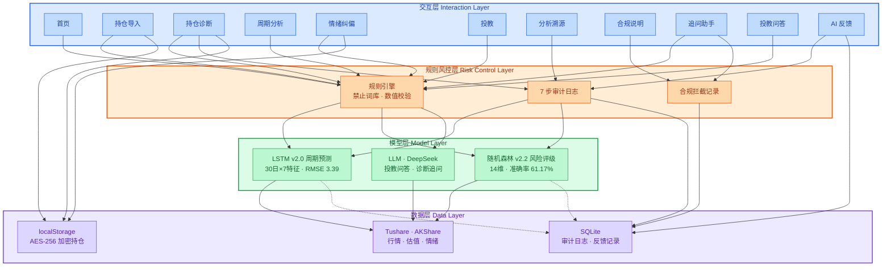
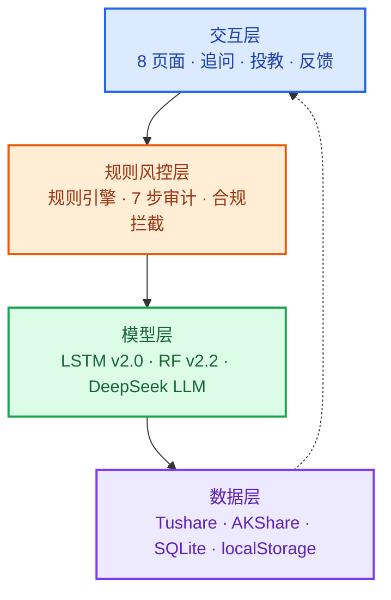

# 灵析 AI 智能投顾助手 — 四层架构图

> 版本：v1.4 · 更新日期：2026-06-23  
> 适用场景：面试作品集 / 架构答辩 / 产品评审

---

## 四层架构总览



---

## 层级说明

| 层级 | 颜色 | 职责 | 核心组件 |
| --- | --- | --- | --- |
| **交互层** | 蓝色 | 用户触达与信息呈现 | 8 大功能页 + 追问助手 + 投教问答 + AI 反馈 |
| **规则风控层** | 橙色 | 合规校验、过程留痕、拦截记录 | 规则引擎、7 步审计、合规拦截 |
| **模型层** | 绿色 | 智能分析与知识生成 | LSTM、随机森林、DeepSeek LLM |
| **数据层** | 紫色 | 数据获取、持久化与隐私存储 | Tushare、AKShare、SQLite、localStorage |

---

## 层间调用关系（简述）

```
交互层
  → 规则风控层：所有用户输入与 AI 输出先过规则引擎；诊断链路写入 7 步审计；越界咨询写入合规记录
  → 数据层：持仓读写 localStorage；反馈与审计写入 SQLite

规则风控层
  → 模型层：规则放行后调用 LSTM / 随机森林 / LLM
  → 数据层：审计与合规记录持久化

模型层
  → 数据层：LSTM / RF 读取 Tushare 行情与 AKShare 估值（Tushare 降级）；分析结果回写审计日志

数据层
  → 向上供给：行情与情绪数据、估值分位、历史审计、本地加密持仓
```

---

## 各层组件清单

### 1. 交互层（蓝色）

| 类型 | 组件 |
| --- | --- |
| 功能页面 | 首页、持仓导入、持仓诊断、周期分析、情绪纠偏、投教、分析溯源、合规说明 |
| 嵌入式能力 | 追问助手（诊断页底部）、投教问答（投教页右侧）、AI 反馈（诊断/分析结果页） |

### 2. 规则风控层（橙色）

| 组件 | 说明 |
| --- | --- |
| 规则引擎 | 禁止词库拦截（荐股、承诺收益等）；数值校验（PE 异常、集中度阈值等） |
| 7 步审计日志 | 请求接收 → 数据获取 → 数据清洗 → 模型预测 → 风险评估 → 规则校验 → 结果生成 |
| 合规拦截记录 | 越界咨询拦截留痕，支撑合规面板实时统计 |

### 3. 模型层（绿色）

| 模型 | 输入特征 | 输出 | 生产指标 |
| --- | --- | --- | --- |
| **LSTM v2.0** | 30 日 × 7 维：close · pct_chg · vol · pe_pct · pb_pct · turnover_rate · amplitude | 未来 5 日 PE 趋势参考 | RMSE **3.39**，MAE **2.52** |
| **随机森林 v2.2** | 14 维（11 基线 + 3 交互：PE×波动率等） | 低 / 中 / 高风险三分类 | 准确率 **61.17%**，F1 **61.19%** |
| **LLM（DeepSeek）** | 用户问题 + 合规 Prompt + 上下文（诊断/投教） | 投教解答、诊断追问回复 | — |

### 4. 数据层（紫色）

| 数据源 | 存储 / 接口 | 用途 |
| --- | --- | --- |
| **Tushare Pro** | 外部行情接口 | 实时行情、行业分类、市场情绪 |
| **AKShare** | 估值接口（优先） | PE/PB 分位；Tushare 不可用时降级 |
| **SQLite** | 服务端本地库 | 审计日志、用户反馈记录 |
| **localStorage** | 浏览器本地 | AES-256 加密持仓，默认不上云 |

---

## 简化版架构图（演讲用）

> 仅展示四层纵向关系，适合 1 分钟快速讲解。


