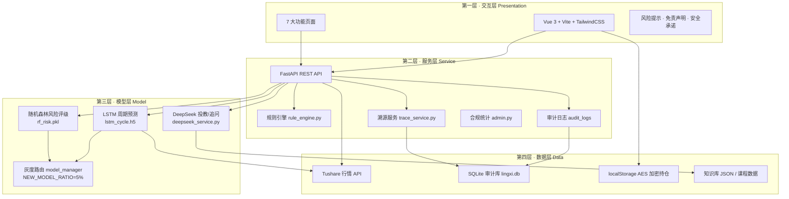
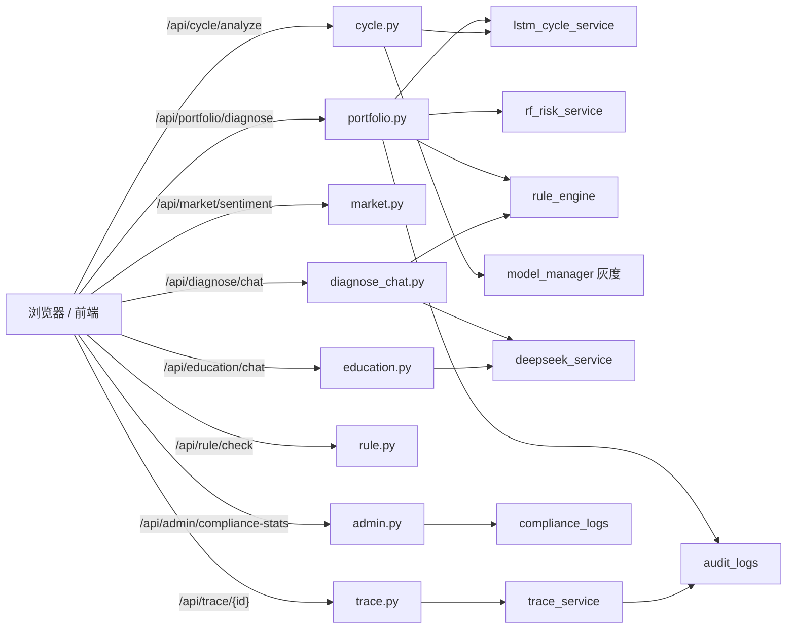
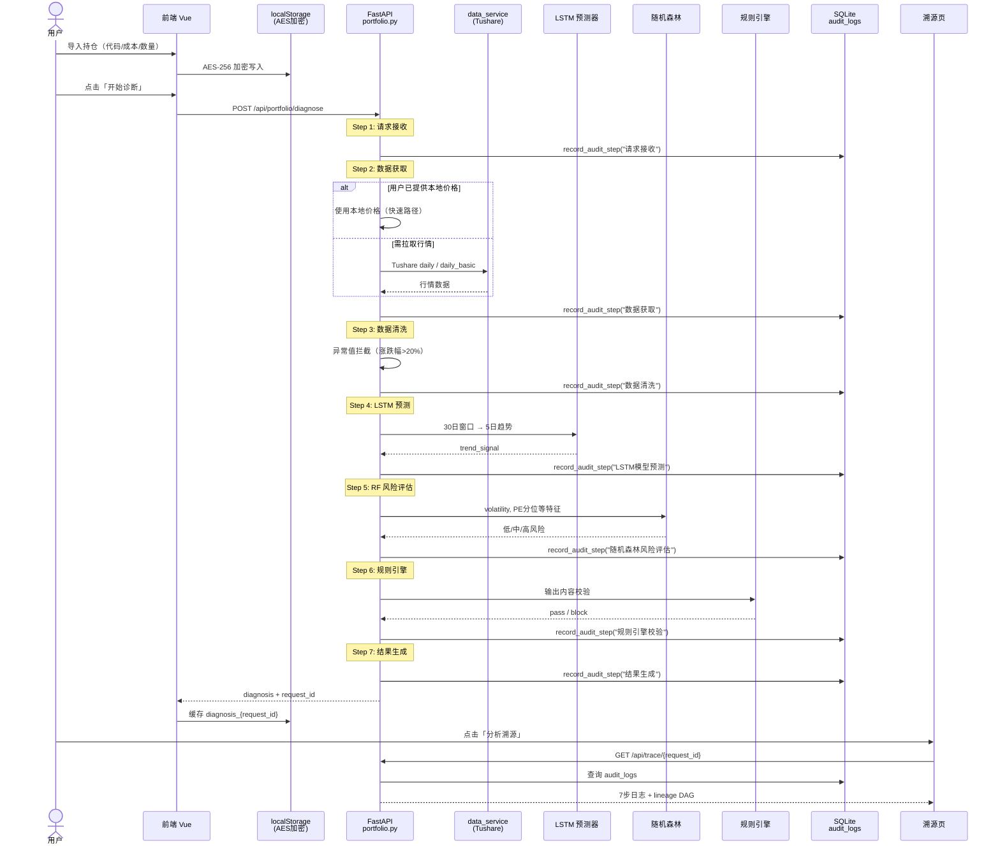
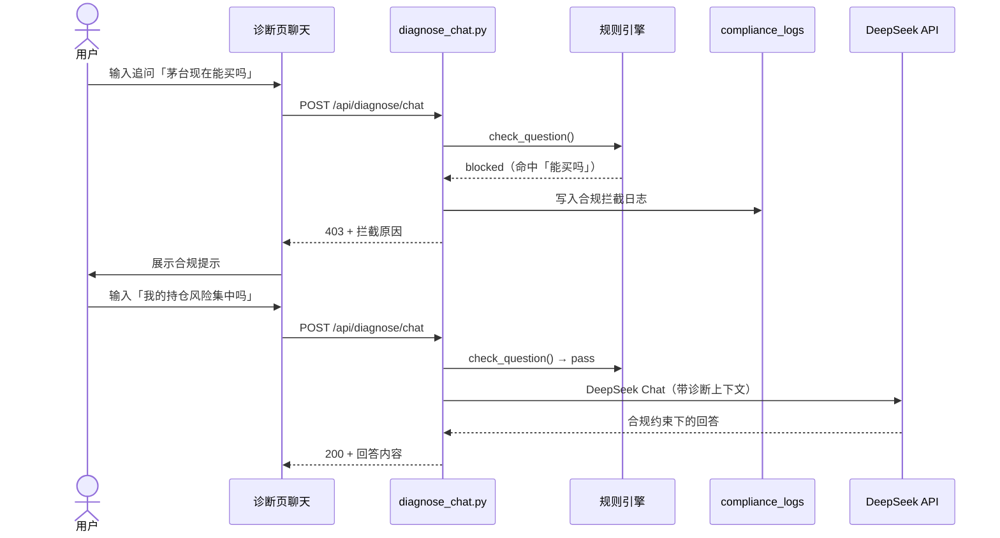
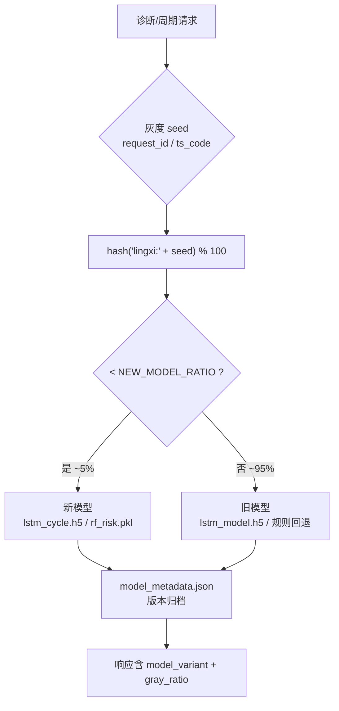
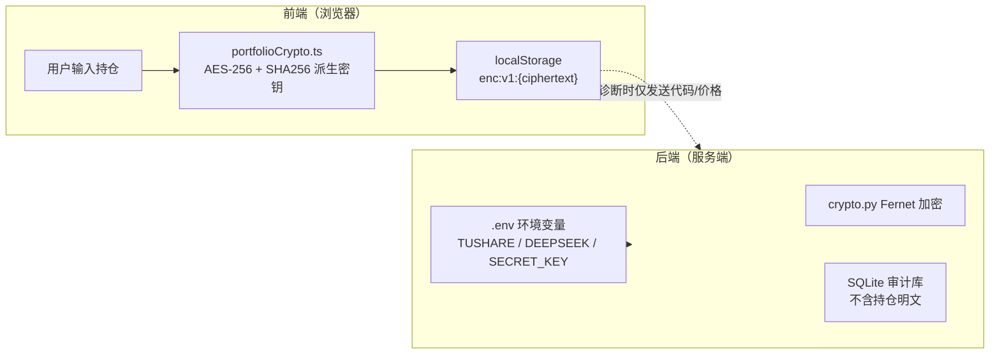
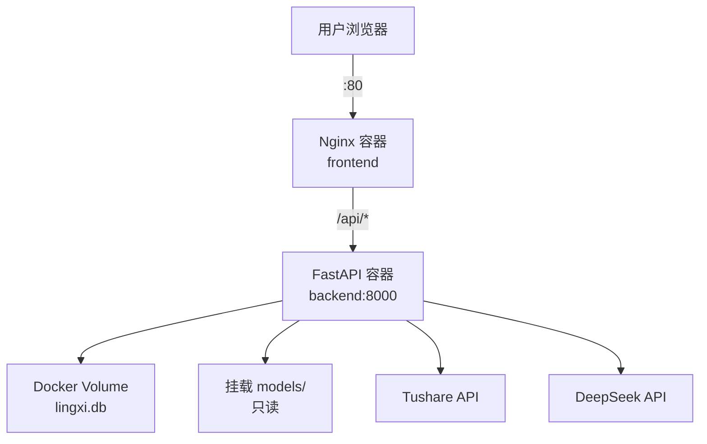

# 灵析 AI 智能投顾助手 — 技术架构文档

> 适用场景：面试作品集 / 技术评审 / 架构答辩

---

## 1. 四层架构总览



---

## 2. 技术栈说明

### 2.1 前端

| 技术 | 版本 | 用途 |
|------|------|------|
| Vue 3 | 3.4 | Composition API + `<script setup>` |
| Vite | 5.x | 构建工具，dev 端口 3015 |
| TypeScript | 5.x | 类型安全 |
| TailwindCSS | 3.x | 原子化样式 |
| Pinia | 2.x | 状态管理（持仓 store） |
| Vue Router | 4.x | Hash 路由 |
| ECharts | 5.x | 溯源血缘 DAG 图 |
| crypto-js | 4.x | AES-256 持仓加密 |

**目录结构：**

```
frontend/src/
├── views/          # 页面（Home, PortfolioDiagnosis, AssetCycle…）
├── components/     # 通用组件（DataLineageChart, RiskBanner…）
├── stores/         # Pinia（portfolio.ts）
├── utils/          # 加密工具（portfolioCrypto.ts）
└── router/         # 路由配置
```

### 2.2 后端

| 技术 | 版本 | 用途 |
|------|------|------|
| FastAPI | 0.104 | REST API 框架 |
| Uvicorn | 0.24 | ASGI 服务器 |
| SQLAlchemy | 2.0 | ORM + SQLite |
| Pandas / NumPy | — | 数据处理 |
| TensorFlow | 2.16 | LSTM 推理 |
| Scikit-learn | 1.3 | 随机森林推理 |
| python-dotenv | — | 环境变量加载 |

**目录结构：**

```
backend/app/
├── api/            # 路由（portfolio, cycle, market, trace, rule…）
├── services/       # 业务逻辑（rule_engine, trace_service, deepseek…）
├── models/         # SQLAlchemy 模型（AuditLog, ComplianceLog）
└── core/           # env_loader 等基础设施

backend/models/     # ML 模型文件 + llm_client
backend/training/   # 训练脚本（train_lstm, train_rf, evaluate_*）
```

### 2.3 部署

| 方式 | 文件 | 说明 |
|------|------|------|
| Docker Compose | `docker-compose.yml` | frontend:80 + backend:8000 |
| 秒悟云平台 | `.env.cloud` | 平台托管，无需 Docker |
| ECS 自建 | `DEPLOY.md` | 阿里云 + Docker 完整指南 |

---

## 3. 核心 API 架构



---

## 4. 数据流图：用户操作 → 审计日志完整链路

以**持仓诊断**为核心链路：



### 4.1 合规追问链路



---

## 5. 模型灰度架构



**关键文件：**

- `backend/app/config.py` — `NEW_MODEL_RATIO = 5`
- `backend/app/services/model_manager.py` — `should_use_new_model()`, `register_model_version()`, `rollback_model()`
- `backend/models/model_metadata.json` — 活跃版本与历史记录

---

## 6. 数据安全架构



**设计原则：**

- 持仓默认**不上传云端**，仅存本地加密  
- 诊断 API 仅接收资产代码与用户填写的价格  
- API Key 仅存服务端 `.env`，前端零接触  
- 用户可随时「清除本地数据」  

---

## 7. 数据库模型（核心表）

| 表名 | 用途 | 关键字段 |
|------|------|----------|
| `audit_logs` | 诊断审计日志 | request_id, step_name, status, detail, created_at |
| `compliance_logs` | 合规拦截记录 | action, matched_word, question, created_at |
| `portfolios` | 服务端持仓（可选） | user_id, assets_json |

---

## 8. 部署架构


