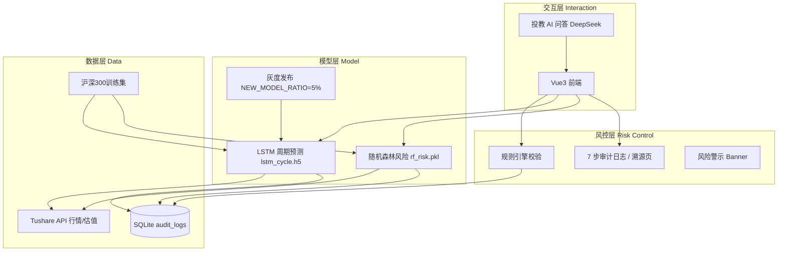

# 灵析 AI 智能投顾助手 — 面试话术与亮点

> 演示链接：部署后填入公网 URL（见 [DEPLOY.md](./DEPLOY.md)）  
> 本地演示：`http://localhost:3015`（前端）+ `http://localhost:8000/docs`（API）

---

## 一、30 秒电梯演讲

「灵析」是一款 **人机协同的 AI 理财辅助工具**。我用 **Vue3 + FastAPI** 做了完整前后端，接入 **Tushare 真实行情**，训练了 **LSTM 周期预测** 和 **随机森林风险评级** 两个模型，并在持仓诊断链路里落库 **7 步审计日志**，溯源页可逐条回放——满足金融场景对 **可解释性** 和 **合规** 的要求。

---

## 二、四层架构图

| 层级 | 技术栈 | 职责 |
|------|--------|------|
| 数据层 | Tushare、SQLite、Parquet 缓存 | 真实行情、审计持久化、训练数据 |
| 模型层 | TensorFlow LSTM、Sklearn RF | 价格趋势、风险分级 |
| 风控层 | 规则引擎 + 审计日志 | 合规兜底、全程可追溯 |
| 交互层 | Vue3、ECharts、DeepSeek | 诊断、溯源、投教问答 |

---

## 三、三大技术亮点（面试重点讲）

### 亮点 1：LSTM 资产周期分析（真实模型推理）

- **做法**：30 日收盘价滑窗 → 预测未来 5 日；MinMaxScaler + `LSTM(64)→Dropout→LSTM(32)→Dense(5)`
- **集成**：`POST /api/cycle/analyze` 在 PE/PB 分位分析基础上，返回 **预测价格 + 置信区间**
- **灰度**：`NEW_MODEL_RATIO=5`，按 request 稳定哈希分流新旧模型
- **评估**：RMSE **13.75**，MAE **4.86**（20 股 × 2 年 MVP 数据）

**话术**：「周期页不是写死的文案，而是 Tushare 估值分位 + 自训练 LSTM 联合输出，并带 confidence interval。」

### 亮点 2：随机森林持仓风控（模型 + 规则双轨）

- **特征**：波动率、换手率、估值分位、成交量变化率
- **标签**：未来 20 日收益分位数 → 低/中/高风险
- **集成**：`POST /api/portfolio/diagnose` 逐步调用 RF，审计日志写入「识别出 X 个风险资产」
- **兜底**：模型未加载时自动降级规则引擎，保证演示不挂

**话术**：「金融场景宁可降级也不能造假，所以做了 model_available 检测和规则 fallback。」

### 亮点 3：合规溯源页（7 步真实审计日志）

- **流程**：请求接收 → 数据获取 → 数据清洗 → LSTM → 随机森林 → 规则校验 → 结果生成
- **存储**：每步写入 SQLite `audit_logs` 表
- **展示**：`GET /api/trace/{request_id}` 按 `id` 排序返回 7 条；前端时间线 **100% 来自 API**，无 mock

**演示路径**：持仓诊断 → 点击「查看溯源」→ 展示 7 步完整链路 + 血缘图

**话术**：「这是我在产品层面回应『AI 黑盒』问题的方案——每个结论都能追溯到具体步骤和当时的数据状态。」

---

## 四、模型评估结果（如实汇报）

| 模型 | 指标 | 当前值 | 说明 |
|------|------|--------|------|
| LSTM | RMSE | 13.75 | 收盘价回归，MVP 20 股 2 年 |
| LSTM | MAE | 4.86 | 测试集 hold-out 20% |
| 随机森林 | 测试准确率 | **43.1%** | 三分类，随机基线 ~33% |
| 随机森林 | F1 (macro) | 0.43 | 详见 `backend/models/reports/evaluation_rf.md` |

### 瓶颈分析

1. **训练数据量不足**：MVP 仅 20 只股票、2 年；未接入完整 daily_basic 估值（Tushare 免费频控）
2. **标签噪声大**：用未来 20 日收益分位数做风险标签，短期波动与「风险」因果弱
3. **类别不平衡**：三分类边界按单股票内分位数，跨股票不可比
4. **特征维度少**：仅 4 维，未加入宏观、行业、资金流向

### 优化方向（展示你「有 roadmap」）

- 扩大至沪深 300 × 3 年，解锁 daily_basic 估值特征
- 改用 **AUC / 分层抽样 / SMOTE** 处理不平衡
- 引入 **XGBoost + SHAP** 增强可解释性
- 在线学习 / 定期 retrain + `model_manager.py` 版本回滚

---

## 五、被问「准确率只有 43%，是不是模型不行？」——标准产品回答

> **「这是 MVP 阶段的有意取舍，不是技术偷懒。」**

1. **目标优先级**：面试项目首先要证明 **全链路可跑通**——真实数据 → 训练 → 推理 → 审计 → 溯源 UI。43% 是在有限数据和频控约束下的 **诚实基线**。
2. **仍优于随机**：三分类随机猜测约 33%，43% 说明特征有一定区分度，但远未达到生产标准——**我知道边界在哪**。
3. **金融更看风控与可解释**：即使 RF 不准，仍有 **规则引擎兜底** + **逐步审计**，不会出现「模型错了但用户无从得知」。
4. **迭代计划清晰**：已预留 `model_metadata.json` 版本管理、灰度比例、评估报告自动化；下一步就是扩数据和调特征。
5. **LSTM 侧表现更好**：回归 MAE 4.86 元，对周期辅助场景更可接受，与分类任务难度不同，要分开讲。

**一句话收尾**：「准确率不是这个阶段的 KPI，**可信、可追溯、可迭代** 才是。」

---

## 六、推荐演示脚本（5 分钟）

| 顺序 | 页面 | 讲什么 |
|------|------|--------|
| 1 | 首页 | 四大原则：人机协同、AI 边界、可解释、分层风控 |
| 2 | 持仓诊断 | 真实 Tushare 行情 → 等 7 步完成 |
| 3 | 溯源页 | **7 步审计日志**、血缘图、Request ID |
| 4 | 资产周期 | LSTM 预测 + 置信区间 |
| 5 | 投教 + AI 问答 | DeepSeek 投教助手 |
| 6 | 合规页 | 能力边界与风控规则 |

---

## 七、技术栈速查（防追问）

- 前端：Vue 3、Vite、TypeScript、TailwindCSS、ECharts、Pinia
- 后端：FastAPI、SQLAlchemy、SQLite、aiohttp
- 模型：TensorFlow/Keras、Scikit-learn、joblib
- 外部：Tushare（行情）、DeepSeek（投教问答）
- 部署：Docker Compose、Nginx 反代、阿里云 ECS

---

## 八、可能被问到的 FAQ

**Q：为什么用 SQLite 不用 PostgreSQL？**  
A：MVP 轻量部署，审计日志量级小；生产可换 `DATABASE_URL` 到 PG，SQLAlchemy 无需改业务代码。

**Q：审计日志会不会被前端伪造？**  
A：日志在后端诊断流程中逐步 `commit` 到 DB，前端只读 API，演示时可打开 `/docs` 展示接口。

**Q：和 ChatGPT 包一层有什么区别？**  
A：有 **领域模型**（LSTM/RF）、**真实行情**、**合规溯源**；LLM 只用于投教问答，不直接给买卖建议。

---

祝面试顺利。
